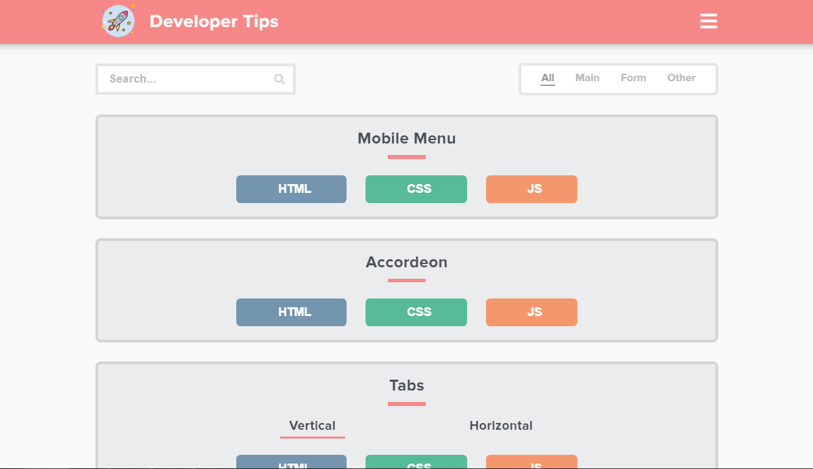

    

<h1 align="center">Kaboo Bear</h1>

[![Forks][forks-shield]][forks-url]
[![Issues][issues-shield]][issues-url]
[![MIT License][license-shield]][license-url]

 
 

 

<a href="https://kaboobear.github.io"> <h2>Developer Tips Project</h2> </a>

### You can use it:
* as a quick solution for your project
* as your own framework
* as building blocks for your page
* just for fun

 
 

<h2 align="center">Screen</h2>

 
 
 

<h2 align="center">Contact Me</h2>

    
<b>Telegram:</b> @kaboo_bear 

    
<b>Gmail:</b> kaboo.bear@gmail.com 

[forks-shield]: https://img.shields.io/github/forks/kaboobear/kaboobear.github.io.svg?style=flat-square
[forks-url]: https://github.com/kaboobear/kaboobear.github.io/network/members
[issues-shield]: https://img.shields.io/github/issues/kaboobear/kaboobear.github.io.svg?style=flat-square
[issues-url]: https://github.com/kaboobear/kaboobear.github.io/issues
[license-shield]: https://img.shields.io/github/license/kaboobear/kaboobear.github.io.svg?style=flat-square
[license-url]: https://github.com/kaboobear/kaboobear.github.io/blob/master/LICENSE.txt

